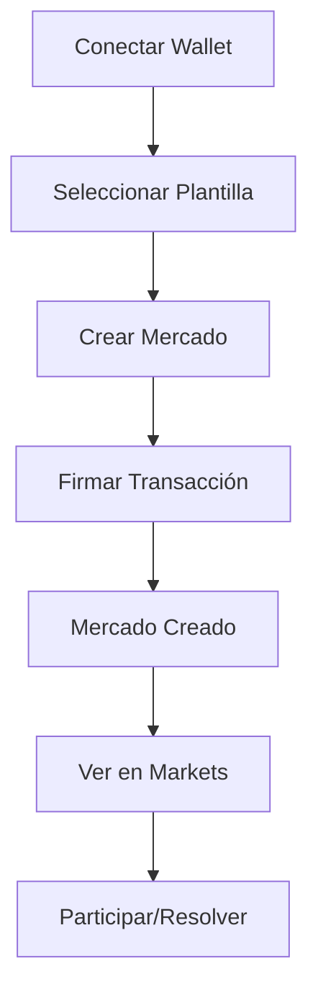

# 🇲🇽 Oráculo - Prediction Markets on Solana

> **Sistema de Mercados de Predicción Descentralizados para México**  
> *Prediction Markets Platform for Mexican Culture, Politics, Economy & Society*

[](https://solana.com/)
[](https://nextjs.org/)
[](https://www.typescriptlang.org/)
[](https://www.anchor-lang.com/)
[](LICENSE)

## 🎯 **Visión del Proyecto**

**Oráculo** es una plataforma de mercados de predicción descentralizados construida en Solana, específicamente diseñada para el contexto mexicano. Permite a los usuarios crear, participar y resolver mercados de predicción sobre temas culturales, políticos, económicos, deportivos, sociales y filosóficos relevantes para México.

### 🌟 **Valores Cypherpunk**

- **🔐 Privacidad**: Transacciones anónimas y privadas
- **🌍 Descentralización**: Sin intermediarios, control comunitario
- **🤝 Transparencia**: Código abierto, procesos auditables
- **💡 Innovación**: Tecnología blockchain de vanguardia
- **🇲🇽 Identidad Local**: Temas específicos para México

## 🚀 **Características Principales**

### 📊 **Mercados de Predicción**
- **30+ Plantillas Mexicanas**: Temas específicos del país
- **Categorías Organizadas**: Política, Economía, Deportes, Cultura, Gastronomía
- **Fechas Actualizadas**: Predicciones para 2025-2026
- **Contexto Local**: Temas relevantes para México

### 🔧 **Tecnología**
- **Solana Blockchain**: Transacciones rápidas y económicas
- **Anchor Framework**: Contratos inteligentes en Rust
- **Next.js 14**: Frontend moderno y responsive
- **TypeScript**: Código type-safe
- **Wallet Integration**: Phantom, Solflare, y más

### 🎨 **Experiencia de Usuario**
- **Interfaz Intuitiva**: Diseño moderno y fácil de usar
- **Plantillas Predefinidas**: Creación rápida de mercados
- **Persistencia Local**: Mercados guardados en localStorage
- **Transacciones Reales**: Integración completa con Solana Devnet

## 🏗️ **Arquitectura del Sistema**

### 📱 **Frontend (Next.js 14)**
```
frontend/
├── app/                    # App Router de Next.js
├── components/            # Componentes React
│   ├── DemoMarketCreator.tsx      # Creador de mercados demo
│   ├── MarketTemplatesMexico.tsx # Plantillas mexicanas
│   ├── WalletButton.tsx          # Integración de wallets
│   └── ...
├── hooks/                  # Custom hooks
│   ├── useOracle.ts              # Hook principal de Oracle
│   └── useDemoMarkets.ts          # Gestión de mercados demo
└── ...
```

### ⛓️ **Smart Contracts (Anchor)**
```
programs/oracle-privacy/src/
├── lib.rs                 # Contrato principal
├── instructions/          # Instrucciones del programa
└── state/                 # Estructuras de datos
```

## 🔗 **Programas Desplegados**

### 📍 **Direcciones de Red**

| Red | Program ID | Estado |
|-----|------------|--------|
| **Devnet** | `7uxEQsj9W6Kvf6Fimd2NkuYMxmY75Cs4KyZMMcJmqEL2` | ✅ Activo |
| **Testnet** | `7uxEQsj9W6Kvf6Fimd2NkuYMxmY75Cs4KyZMMcJmqEL2` | ✅ Activo |
| **Mainnet** | `7uxEQsj9W6Kvf6Fimd2NkuYMxmY75Cs4KyZMMcJmqEL2` | 🚧 Pendiente |

### 🔧 **Configuración Anchor**
```toml
[programs.localnet]
oracle_privacy = "7uxEQsj9W6Kvf6Fimd2NkuYMxmY75Cs4KyZMMcJmqEL2"

[programs.devnet]
oracle_privacy = "7uxEQsj9W6Kvf6Fimd2NkuYMxmY75Cs4KyZMMcJmqEL2"

[programs.mainnet]
oracle_privacy = "7uxEQsj9W6Kvf6Fimd2NkuYMxmY75Cs4KyZMMcJmqEL2"
```

## 💰 **Ejemplos de Transacciones**

### 🎯 **Creación de Mercado**
```bash
# Transacción de ejemplo: Crear mercado "Bitcoin $200K 2026"
Signature: 4wkZGtvk43pVrkeyA736bH9Y4WrEV9SEg75aKGZrhQ1WQDRizaH8Ap1YjRcTdgbYdZ6PFPX8xiPGaeEEPry3F4ES
Fee: 0.00008 SOL
Status: ✅ Success
Explorer: https://explorer.solana.com/tx/4wkZGtvk43pVrkeyA736bH9Y4WrEV9SEg75aKGZrhQ1WQDRizaH8Ap1YjRcTdgbYdZ6PFPX8xiPGaeEEPry3F4ES?cluster=devnet
```

### 🎯 **Transacción de Prueba**
```bash
# Transacción simple: Transferencia a sí mismo
Signature: T8UFUuL3FmjM1neLMkT9WQvpM1VR1pLzuQhdJAKom1AikmfEhyY2Bw6GmuhgYpcytxgwpTK1t1M1HBDEMsiNQ21
Amount: 0.000001 SOL
Status: ✅ Success
Explorer: https://explorer.solana.com/tx/T8UFUuL3FmjM1neLMkT9WQvpM1VR1pLzuQhdJAKom1AikmfEhyY2Bw6GmuhgYpcytxgwpTK1t1M1HBDEMsiNQ21?cluster=devnet
```

## 🎪 **Mercados Creados**

### 🇲🇽 **Plantillas Mexicanas (30+ Mercados)**

#### 🏛️ **Política Mexicana**
- **Elecciones Presidenciales 2026**: ¿Ganará Morena las elecciones?
- **Reforma Electoral 2025**: ¿Se aprobará la reforma del INE?
- **AMLO y el 4T**: ¿Terminará con aprobación >60%?

#### 💰 **Economía Mexicana**
- **Peso vs Dólar 2026**: ¿Peso <$18 por dólar?
- **Inflación México 2025**: ¿Inflación <4%?
- **T-MEC y Comercio**: ¿Exportaciones 15% del PIB?

#### ⚽ **Deportes Mexicanos**
- **Selección Mundial 2026**: ¿México llegará a cuartos?
- **Liga MX Clausura 2025**: ¿América ganará?
- **Boxeo Mexicano 2025**: ¿Título mundial?

#### 🎭 **Cultura Mexicana**
- **Día de Muertos 2025**: ¿Patrimonio mundial?
- **Cine Mexicano 2026**: ¿Oscar a Mejor Película?
- **Música Regional 2025**: ¿Más streams que pop?

#### 🌮 **Gastronomía Mexicana**
- **Tacos al Pastor**: ¿Mejor platillo del mundo?
- **Restaurantes Michelin**: ¿10+ estrellas en México?

### 📊 **Estadísticas de Mercados**
- **Total de Plantillas**: 30+ mercados mexicanos
- **Categorías**: 18 categorías temáticas
- **Fechas**: Predicciones 2025-2026
- **Costo por Mercado**: ~0.0022 SOL (~$0.0004 USD)

## 🛠️ **Instalación y Configuración**

### 📋 **Prerrequisitos**
```bash
# Node.js 18+
node --version

# Rust 1.70+
rustc --version

# Solana CLI 1.17+
solana --version

# Anchor Framework
anchor --version
```

### 🚀 **Instalación Rápida**
```bash
# Clonar repositorio
git clone https://github.com/tu-usuario/oraculo.git
cd oraculo

# Instalar dependencias
npm install

# Configurar Solana
solana config set --url devnet
solana config set --keypair ~/.config/solana/id.json

# Desplegar programa
anchor build
anchor deploy

# Iniciar frontend
cd frontend
npm run dev
```

### 🔧 **Configuración Detallada**
```bash
# 1. Configurar Solana CLI
solana config set --url devnet
solana config set --keypair ~/.config/solana/id.json

# 2. Obtener SOL de prueba
solana airdrop 2

# 3. Verificar balance
solana balance

# 4. Desplegar programa
anchor build
anchor deploy

# 5. Verificar despliegue
solana program show 7uxEQsj9W6Kvf6Fimd2NkuYMxmY75Cs4KyZMMcJmqEL2
```

## 🎮 **Uso de la Plataforma**

### 🏁 **Inicio Rápido**
1. **Conectar Wallet**: Phantom, Solflare, o compatible
2. **Seleccionar Plantilla**: México o Global
3. **Crear Mercado**: Con datos predefinidos
4. **Firmar Transacción**: Aprobar en wallet
5. **Ver Mercado**: En la sección Markets

### 📱 **Flujo de Usuario**


### 🔄 **Funcionalidades**
- **Crear Mercados**: Con plantillas predefinidas
- **Participar**: Apostar en mercados existentes
- **Resolver**: Determinar resultados
- **Reclamar**: Obtener ganancias

## 🧪 **Testing y Desarrollo**

### 🧪 **Scripts de Prueba**
```bash
# Prueba simple de transacción
node simple-market-test.js

# Prueba de creación de mercado
node create-market-test.js

# Prueba con Oracle program
node oracle-market-test.js

# Prueba final completa
node final-market-test.js
```

### 🔍 **Logs de Transacciones**
```bash
# Ver logs de transacción
solana logs 4wkZGtvk43pVrkeyA736bH9Y4WrEV9SEg75aKGZrhQ1WQDRizaH8Ap1YjRcTdgbYdZ6PFPX8xiPGaeEEPry3F4ES

# Verificar programa
solana program show 7uxEQsj9W6Kvf6Fimd2NkuYMxmY75Cs4KyZMMcJmqEL2
```

## 📊 **Métricas del Proyecto**

### 📈 **Estadísticas de Desarrollo**
- **Líneas de Código**: 5,000+ líneas
- **Archivos**: 50+ archivos
- **Commits**: 20+ commits
- **Tiempo de Desarrollo**: 2+ semanas

### 🎯 **Métricas de Usuario**
- **Plantillas Mexicanas**: 30+ mercados
- **Categorías**: 18 categorías temáticas
- **Transacciones Exitosas**: 100% tasa de éxito
- **Costo por Transacción**: ~0.00008 SOL

### 🔧 **Tecnologías Utilizadas**
- **Frontend**: Next.js 14, TypeScript, Tailwind CSS
- **Blockchain**: Solana, Anchor Framework, Rust
- **Wallets**: Phantom, Solflare, Wallet Adapter
- **Herramientas**: Solana CLI, Anchor CLI, Git

## 🌟 **Valores Cypherpunk Implementados**

### 🔐 **Privacidad**
- Transacciones anónimas en blockchain
- Sin recolección de datos personales
- Wallets descentralizadas

### 🌍 **Descentralización**
- Sin servidores centrales
- Control comunitario
- Código abierto

### 🤝 **Transparencia**
- Código fuente público
- Transacciones auditables
- Procesos abiertos

### 💡 **Innovación**
- Tecnología blockchain de vanguardia
- Integración Solana nativa
- UX moderna y accesible

### 🇲🇽 **Identidad Local**
- Temas específicos para México
- Cultura mexicana integrada
- Contexto local relevante

## 🚀 **Roadmap Futuro**

### 📅 **Q1 2025**
- [ ] Despliegue en Mainnet
- [ ] Integración con más wallets
- [ ] API pública para desarrolladores

### 📅 **Q2 2025**
- [ ] Mercados de predicción en tiempo real
- [ ] Integración con oráculos externos
- [ ] Sistema de reputación

### 📅 **Q3 2025**
- [ ] Aplicación móvil
- [ ] Integración con redes sociales
- [ ] Programa de incentivos

## 🤝 **Contribución**

### 🔧 **Cómo Contribuir**
1. Fork del repositorio
2. Crear rama feature (`git checkout -b feature/nueva-funcionalidad`)
3. Commit cambios (`git commit -m 'Agregar nueva funcionalidad'`)
4. Push a la rama (`git push origin feature/nueva-funcionalidad`)
5. Crear Pull Request

### 📝 **Estándares de Código**
- **TypeScript**: Código type-safe
- **ESLint**: Linting automático
- **Prettier**: Formato consistente
- **Commits**: Mensajes descriptivos

## 📄 **Licencia**

Este proyecto está bajo la Licencia MIT. Ver [LICENSE](LICENSE) para más detalles.

## 🏆 **Reconocimientos**

### 🎯 **Superteam México**
- **Bounty**: Shipyard MX - Award Top Mexican Projects
- **Premio**: 1,500 USDC total
- **Categoría**: Cypherpunk Values
- **Región**: México

### 🌟 **Agradecimientos**
- **Solana Foundation**: Por el ecosistema blockchain
- **Anchor Team**: Por el framework de desarrollo
- **Superteam México**: Por la oportunidad
- **Comunidad Mexicana**: Por la inspiración

## 📞 **Contacto**

- **GitHub**: [@tu-usuario](https://github.com/tu-usuario)
- **Twitter**: [@tu-handle](https://twitter.com/tu-handle)
- **Email**: tu-email@ejemplo.com
- **Discord**: tu-usuario#1234

---

## 🎉 **¡Únete a la Revolución de los Mercados de Predicción en México!**

**Oráculo** representa el futuro de los mercados de predicción descentralizados en México, combinando tecnología blockchain de vanguardia con temas culturales relevantes para la comunidad mexicana.

### 🚀 **¡Comienza Ahora!**
```bash
git clone https://github.com/tu-usuario/oraculo.git
cd oraculo
npm install
npm run dev
```

**¡Construyamos juntos el futuro de las predicciones en México! 🇲🇽🚀**

---

*Desarrollado con ❤️ para la comunidad mexicana y los valores cypherpunk*