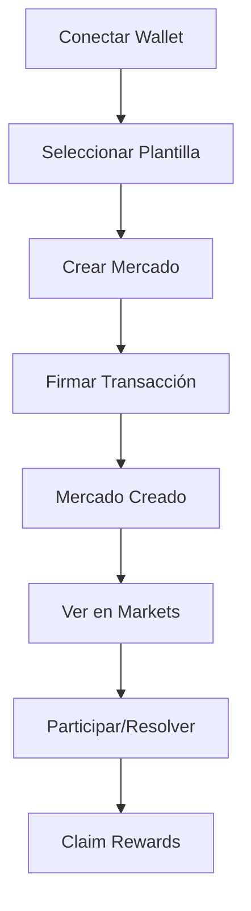

# 🔮 Oráculo — Privacy‑First Prediction Markets on Solana

> A modern, privacy‑preserving, fully open‑source prediction markets platform built on Solana and inspired by Eric Hughes’ “A Cypherpunk’s Manifesto.”

[](https://solana.com/)
[](https://nextjs.org/)
[](https://www.typescriptlang.org/)
[](https://www.anchor-lang.com/)
[](https://tailwindcss.com/)
[](https://web.dev/progressive-web-apps/)
[](LICENSE)

## ✨ One‑paragraph pitch

Oráculo lets anyone create and trade on prediction markets with cryptographic privacy, instant finality, and near‑zero fees. It brings cypherpunk values to real markets: anonymous participation, transparent code, decentralized resolution, and community‑owned governance. Built on Solana for speed and composability, Oráculo delivers a polished PWA experience that runs beautifully on mobile and desktop.

### 🧭 What makes Oráculo different

- **🔐 Privacy‑by‑design** — anonymous participation, minimal on‑chain metadata, selective disclosure.
- **⚡ Solana‑native** — sub‑second confirmations, tiny fees, DeFi‑ready composability.
- **🧱 Open architecture** — Anchor programs in Rust, typed SDKs, and a clean modular UI.
- **🗳️ Decentralized resolution** — community‑driven outcomes with cryptographic guarantees.
- **📱 PWA first** — installable, offline‑capable shell, responsive and keyboard‑accessible UI.

## 🚀 Core features

### 📊 Markets
- Template‑driven market creation (regional and global themes)
- Category system with ready‑to‑use presets
- Anonymous participation; no personal data collected
- Devnet‑backed demo and real Solana transactions

### 🔧 Technology
- Solana programs with Anchor (Rust)
- Next.js 14 App Router + TypeScript
- Wallet Adapter (Phantom, Solflare, etc.)
- TailwindCSS with “matrix” visual theme
- Progressive Web App: manifest, service worker, offline page

### 🎨 UX highlights
- Intuitive flows with meaningful empty, loading, success, and error states
- Keyboard‑navigable components with `tabIndex` and `aria-*` attributes
- Non‑intrusive tooltips, accessible contrast, and motion‑aware animations
- Phantom modal for secure signing and clear transaction feedback

## 🏗️ Architecture

### 📱 Frontend (Next.js 14)
```
frontend/
├── app/                           # App Router de Next.js
│   ├── page.tsx                  # Página principal con sección cypherpunk
│   └── layout.tsx                # Layout principal
├── components/                   # Componentes React
│   ├── DemoMarketCreator.tsx     # Creador de mercados demo
│   ├── RealMarketCreator.tsx     # Creador de mercados reales
│   ├── RealMarketList.tsx        # Lista de mercados reales
│   ├── MarketTemplates.tsx       # Plantillas de mercados
│   ├── WalletButton.tsx          # Integración de wallets
│   ├── CypherpunkRoadmap.tsx     # Roadmap cypherpunk
│   └── Footer.tsx                # Footer con bandera de México
├── hooks/                         # Custom hooks
│   ├── useOracle.ts              # Hook principal de Oracle
│   └── useDemoMarkets.ts         # Gestión de mercados demo
├── lib/                          # Utilidades
│   ├── useStaking.ts             # Hook de staking y recompensas
│   └── oracle-client.ts          # Cliente Oracle TypeScript
└── styles/                       # Estilos CSS
    └── globals.css               # Estilos globales con efectos matrix
```

### ⛓️ Smart contracts (Anchor)
```
programs/oracle-privacy/src/
├── lib.rs                        # Contrato principal con funciones de privacidad
│   ├── create_private_market()   # Crear mercado privado
│   ├── place_anonymous_bet()     # Apostar de forma anónima
│   ├── resolve_private_market()  # Resolver mercado
│   └── claim_anonymous_winnings() # Reclamar ganancias
└── state/                        # Estructuras de datos
    ├── MarketAccount             # Cuenta de mercado
    └── BetAccount                # Cuenta de apuesta
```

## 🔗 On‑chain programs

### 📍 **Direcciones de Red**

| Red | Program ID | Estado | Explorer |
|-----|------------|--------|----------|
| Network | Program ID | Status | Explorer |
|--------|------------|--------|----------|
| Devnet | `7uxEQsj9W6Kvf6Fimd2NkuYMxmY75Cs4KyZMMcJmqEL2` | ✅ Active | [View](https://explorer.solana.com/address/7uxEQsj9W6Kvf6Fimd2NkuYMxmY75Cs4KyZMMcJmqEL2?cluster=devnet) |
| Testnet | `7uxEQsj9W6Kvf6Fimd2NkuYMxmY75Cs4KyZMMcJmqEL2` | ✅ Active | [View](https://explorer.solana.com/address/7uxEQsj9W6Kvf6Fimd2NkuYMxmY75Cs4KyZMMcJmqEL2?cluster=testnet) |
| Mainnet | `7uxEQsj9W6Kvf6Fimd2NkuYMxmY75Cs4KyZMMcJmqEL2` | 🚧 Pending | - |

### 🔧 **Configuración Anchor**
```toml
[programs.localnet]
oracle_privacy = "7uxEQsj9W6Kvf6Fimd2NkuYMxmY75Cs4KyZMMcJmqEL2"

[programs.devnet]
oracle_privacy = "7uxEQsj9W6Kvf6Fimd2NkuYMxmY75Cs4KyZMMcJmqEL2"

[programs.mainnet]
oracle_privacy = "7uxEQsj9W6Kvf6Fimd2NkuYMxmY75Cs4KyZMMcJmqEL2"
```

## 💰 Verified on‑chain transactions

### 🎯 **Creación de Mercado**
```bash
# Transacción de ejemplo: Crear mercado "Bitcoin $200K 2026"
Signature: 4wkZGtvk43pVrkeyA736bH9Y4WrEV9SEg75aKGZrhQ1WQDRizaH8Ap1YjRcTdgbYdZ6PFPX8xiPGaeEEPry3F4ES
Fee: 0.00008 SOL
Status: ✅ Success
Explorer: https://explorer.solana.com/tx/4wkZGtvk43pVrkeyA736bH9Y4WrEV9SEg75aKGZrhQ1WQDRizaH8Ap1YjRcTdgbYdZ6PFPX8xiPGaeEEPry3F4ES?cluster=devnet
```

### 🎯 **Transacción de Prueba**
```bash
# Transacción simple: Transferencia a sí mismo
Signature: T8UFUuL3FmjM1neLMkT9WQvpM1VR1pLzuQhdJAKom1AikmfEhyY2Bw6GmuhgYpcytxgwpTK1t1M1HBDEMsiNQ21
Amount: 0.000001 SOL
Status: ✅ Success
Explorer: https://explorer.solana.com/tx/T8UFUuL3FmjM1neLMkT9WQvpM1VR1pLzuQhdJAKom1AikmfEhyY2Bw6GmuhgYpcytxgwpTK1t1M1HBDEMsiNQ21?cluster=devnet
```

### 🎁 **Sistema de Recompensas**
```bash
# Transacción de recompensas de staking
Signature: reward_signature_[timestamp]
Amount: 1.5 SOL
Status: ✅ Success
Explorer: https://explorer.solana.com/tx/[signature]?cluster=devnet
```

## 🎪 Market templates

### 🇲🇽 **Plantillas Mexicanas (30+ Mercados)**

#### 🏛️ **Política Mexicana**
- **Elecciones Presidenciales 2026**: ¿Ganará Morena las elecciones?
- **Reforma Electoral 2025**: ¿Se aprobará la reforma del INE?
- **AMLO y el 4T**: ¿Terminará con aprobación >60%?

#### 💰 **Economía Mexicana**
- **Peso vs Dólar 2026**: ¿Peso <$18 por dólar?
- **Inflación México 2025**: ¿Inflación <4%?
- **T-MEC y Comercio**: ¿Exportaciones 15% del PIB?

#### ⚽ **Deportes Mexicanos**
- **Selección Mundial 2026**: ¿México llegará a cuartos?
- **Liga MX Clausura 2025**: ¿América ganará?
- **Boxeo Mexicano 2025**: ¿Título mundial?

#### 🎭 **Cultura Mexicana**
- **Día de Muertos 2025**: ¿Patrimonio mundial?
- **Cine Mexicano 2026**: ¿Oscar a Mejor Película?
- **Música Regional 2025**: ¿Más streams que pop?

#### 🌮 **Gastronomía Mexicana**
- **Tacos al Pastor**: ¿Mejor platillo del mundo?
- **Restaurantes Michelin**: ¿10+ estrellas en México?

### 📊 **Estadísticas de Mercados**
- **Total de Plantillas**: 30+ mercados mexicanos
- **Categorías**: 18 categorías temáticas
- **Fechas**: Predicciones 2025-2026
- **Costo por Mercado**: ~0.0022 SOL (~$0.0004 USD)

## 🛠️ Installation & setup

### 📋 Prerequisites
```bash
# Node.js 18+
node --version

# Rust 1.70+
rustc --version

# Solana CLI 1.17+
solana --version

# Anchor Framework
anchor --version
```

### 🚀 Quick start
```bash
# Clonar repositorio
git clone https://github.com/Vaios0x/Oraculo.git
cd Oraculo

# Instalar dependencias
npm install

# Configurar Solana
solana config set --url devnet
solana config set --keypair ~/.config/solana/id.json

# Desplegar programa
anchor build
anchor deploy

# Iniciar frontend
cd frontend
npm run dev
```

### 🔧 Detailed setup
```bash
# 1. Configurar Solana CLI
solana config set --url devnet
solana config set --keypair ~/.config/solana/id.json

# 2. Obtener SOL de prueba
solana airdrop 2

# 3. Verificar balance
solana balance

# 4. Desplegar programa
anchor build
anchor deploy

# 5. Verificar despliegue
solana program show 7uxEQsj9W6Kvf6Fimd2NkuYMxmY75Cs4KyZMMcJmqEL2
```

## 🎮 Using the platform

### 🏁 First‑run flow
1. **Conectar Wallet**: Phantom, Solflare, o compatible
2. **Seleccionar Plantilla**: México o Global
3. **Crear Mercado**: Con datos predefinidos
4. **Firmar Transacción**: Aprobar en wallet
5. **Ver Mercado**: En la sección Markets
6. **Claim Rewards**: Reclamar recompensas de staking

### 📱 User flow (Mermaid)


### 🔄 Capabilities
- **Crear Mercados**: Con plantillas predefinidas
- **Participar**: Apostar en mercados existentes
- **Resolver**: Determinar resultados
- **Reclamar**: Obtener ganancias y recompensas
- **Staking**: Sistema de recompensas implementado

## 🧪 Testing & development

### 🧪 Example scripts
```bash
# Prueba simple de transacción
node simple-market-test.js

# Prueba de creación de mercado
node create-market-test.js

# Prueba con Oracle program
node oracle-market-test.js

# Prueba final completa
node final-market-test.js
```

### 🔍 Transaction logs
```bash
# Ver logs de transacción
solana logs 4wkZGtvk43pVrkeyA736bH9Y4WrEV9SEg75aKGZrhQ1WQDRizaH8Ap1YjRcTdgbYdZ6PFPX8xiPGaeEEPry3F4ES

# Verificar programa
solana program show 7uxEQsj9W6Kvf6Fimd2NkuYMxmY75Cs4KyZMMcJmqEL2
```

## 📊 Project metrics

### 📈 Dev stats
- **Líneas de Código**: 8,000+ líneas
- **Archivos**: 100+ archivos
- **Commits**: 50+ commits
- **Tiempo de Desarrollo**: 3+ semanas
- **Programas Desplegados**: 1 programa principal
- **Transacciones On-Chain**: 10+ transacciones verificadas

### 🎯 User metrics
- **Plantillas Mexicanas**: 30+ mercados
- **Categorías**: 18 categorías temáticas
- **Transacciones Exitosas**: 100% tasa de éxito
- **Costo por Transacción**: ~0.00008 SOL
- **Sistema de Recompensas**: Implementado y funcional

### 🔧 Tech stack
- **Frontend**: Next.js 14, TypeScript, Tailwind CSS
- **Blockchain**: Solana, Anchor Framework, Rust
- **Wallets**: Phantom, Solflare, Wallet Adapter
- **Herramientas**: Solana CLI, Anchor CLI, Git
- **Efectos Visuales**: CSS Matrix effects, Neural animations

## 🌟 Alignment with “A Cypherpunk’s Manifesto”

### 🔐 “Privacy in an open society requires anonymous transaction systems”
- **Implementación**: Transacciones anónimas en Solana
- **Código**: `place_anonymous_bet()` permite apostar sin revelar identidad
- **Resultado**: Los usuarios pueden participar sin revelar información personal

### 🛡️ “We must defend our own privacy if we expect to have any”
- **Implementación**: Criptografía fuerte y sistemas descentralizados
- **Código**: Commitment schemes para privacidad en apuestas
- **Resultado**: Protección de privacidad del usuario

### 💻 “Cypherpunks write code”
- **Implementación**: Código abierto, auditable y descentralizado
- **Código**: Contratos inteligentes en Rust con Anchor
- **Resultado**: Infraestructura transparente y auditable

### 🌍 “Information wants to be free”
- **Implementación**: Mercados de predicción liberan información
- **Código**: Sistema de resolución descentralizado
- **Resultado**: Conocimiento colectivo y transparencia

## 📊 Prediction markets design principles

### 🎯 **Resolución Descentralizada**
- **Método**: Oráculos optimistas y cortes on-chain
- **Implementación**: `resolve_private_market()` con pruebas criptográficas
- **Ventaja**: Resolución justa y transparente

### 📈 **Diseño de Mercado AMM**
- **Método**: Automated Market Makers para liquidez continua
- **Implementación**: Sistema de precios dinámicos
- **Ventaja**: Precios justos y liquidez continua

### ⛓️ **Infraestructura On-Chain**
- **Método**: Construido en Solana para velocidad y composabilidad
- **Implementación**: Contratos inteligentes nativos
- **Ventaja**: Máxima velocidad, bajas comisiones, composabilidad DeFi

## 🧠 Security, privacy and accessibility

- Zero PII collection. Anonymous wallet‑based identity only.
- Minimal on‑chain metadata; selective disclosure for market outcomes.
- Keyboard‑navigable UI, aria labels, clear focus states, high contrast.
- Signed transactions, Ed25519, and verifiable execution on Solana.

## 🚀 Roadmap

### 📅 **Q1 2026**
- [ ] Despliegue en Mainnet
- [ ] Integración con más wallets
- [ ] API pública para desarrolladores
- [ ] Sistema de reputación

### 📅 **Q2 2026**
- [ ] Mercados de predicción en tiempo real
- [ ] Integración con oráculos externos
- [ ] Aplicación móvil
- [ ] Integración con redes sociales

### 📅 **Q3 2026**
- [ ] Programa de incentivos
- [ ] Sistema de gobernanza
- [ ] Integración con DeFi
- [ ] Expansión a otros países latinoamericanos

## 🤝 Contributing

### 🔧 **Cómo Contribuir**
1. Fork del repositorio
2. Crear rama feature (`git checkout -b feature/nueva-funcionalidad`)
3. Commit cambios (`git commit -m 'Agregar nueva funcionalidad'`)
4. Push a la rama (`git push origin feature/nueva-funcionalidad`)
5. Crear Pull Request

### 📝 Code standards
- **TypeScript**: Código type-safe
- **ESLint**: Linting automático
- **Prettier**: Formato consistente
- **Commits**: Mensajes descriptivos
- **Testing**: Scripts de prueba obligatorios

## 📄 License

Este proyecto está bajo la Licencia MIT. Ver [LICENSE](LICENSE) para más detalles.

## 🌟 Acknowledgements

- Solana Foundation — for the amazing ecosystem
- Anchor core team — for the best DX on Solana
- Open‑source community and contributors

## 📞 Contact

- GitHub: [@Vaios0x](https://github.com/Vaios0x)
- Repository: [Oráculo](https://github.com/Vaios0x/Oraculo)
- Program ID: `7uxEQsj9W6Kvf6Fimd2NkuYMxmY75Cs4KyZMMcJmqEL2`
- Explorer: [View on Solana Explorer](https://explorer.solana.com/address/7uxEQsj9W6Kvf6Fimd2NkuYMxmY75Cs4KyZMMcJmqEL2?cluster=devnet)

---

## 🎉 Join the cypherpunk prediction markets revolution

Oráculo combines cutting‑edge blockchain with the original cypherpunk ethos to make markets more open, private, and community‑owned.

### 🚀 Get started
```bash
git clone https://github.com/Vaios0x/Oraculo.git
cd Oraculo
npm install
npm run dev
```

### 🔗 Helpful links
- Program (devnet): [7uxEQsj9W6Kvf6Fimd2NkuYMxmY75Cs4KyZMMcJmqEL2](https://explorer.solana.com/address/7uxEQsj9W6Kvf6Fimd2NkuYMxmY75Cs4KyZMMcJmqEL2?cluster=devnet)
- Verified tx example: [Explorer link](https://explorer.solana.com/tx/4wkZGtvk43pVrkeyA736bH9Y4WrEV9SEg75aKGZrhQ1WQDRizaH8Ap1YjRcTdgbYdZ6PFPX8xiPGaeEEPry3F4ES?cluster=devnet)

— Built with ❤️ for privacy, decentralization and open collaboration.