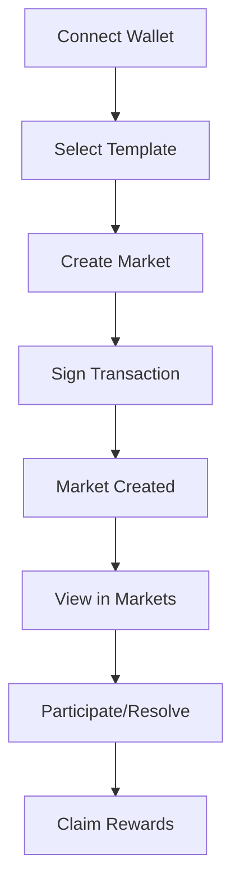

# 🔮 Oráculo — Privacy‑First Prediction Markets on Solana

> A modern, privacy‑preserving, fully open‑source prediction markets platform built on Solana and inspired by Eric Hughes' "A Cypherpunk's Manifesto."

[](https://solana.com/)
[](https://nextjs.org/)
[](https://www.typescriptlang.org/)
[](https://www.anchor-lang.com/)
[](https://tailwindcss.com/)
[](https://web.dev/progressive-web-apps/)
[](LICENSE)

## ✨ One‑paragraph pitch

Oráculo lets anyone create and trade on prediction markets with cryptographic privacy, instant finality, and near‑zero fees. It brings cypherpunk values to real markets: anonymous participation, transparent code, decentralized resolution, and community‑owned governance. Built on Solana for speed and composability, Oráculo delivers a polished PWA experience that runs beautifully on mobile and desktop.

### 🧭 What makes Oráculo different

- **🔐 Privacy‑by‑design** — anonymous participation, minimal on‑chain metadata, selective disclosure.
- **⚡ Solana‑native** — sub‑second confirmations, tiny fees, DeFi‑ready composability.
- **🧱 Open architecture** — Anchor programs in Rust, typed SDKs, and a clean modular UI.
- **🗳️ Decentralized resolution** — community‑driven outcomes with cryptographic guarantees.
- **📱 PWA first** — installable, offline‑capable shell, responsive and keyboard‑accessible UI.

## 🚀 Core features

### 📊 Markets
- **Global template library** — 50+ ready‑to‑use market templates across 12 categories
- **Regional templates** — Mexican‑specific markets for local context
- **Category system** — Cryptocurrencies, Technology, Politics, Sports, Entertainment, Science, Environment, Economy, Health, Space, Gaming, Culture
- **Anonymous participation** — no personal data collected, wallet‑based identity only
- **Devnet & mainnet ready** — demo mode and real Solana transactions

### 🔧 Technology
- **Solana programs** with Anchor (Rust)
- **Next.js 14** App Router + TypeScript
- **Wallet Adapter** (Phantom, Solflare, etc.)
- **TailwindCSS** with "matrix" visual theme
- **Progressive Web App** — manifest, service worker, offline page

### 🎨 UX highlights
- **Intuitive flows** with meaningful empty, loading, success, and error states
- **Keyboard‑navigable** components with `tabIndex` and `aria-*` attributes
- **Non‑intrusive tooltips**, accessible contrast, and motion‑aware animations
- **Phantom modal** for secure signing and clear transaction feedback

## 🏗️ Architecture

### 📱 Frontend (Next.js 14)
```
frontend/
├── app/                           # Next.js App Router
│   ├── page.tsx                  # Main page with cypherpunk section
│   └── layout.tsx                # Root layout
├── components/                   # React components
│   ├── DemoMarketCreator.tsx     # Demo market creator
│   ├── RealMarketCreator.tsx     # Real market creator
│   ├── RealMarketList.tsx        # Real markets list
│   ├── MarketTemplates.tsx       # Global market templates
│   ├── MarketTemplatesMexico.tsx # Mexican market templates
│   ├── WalletButton.tsx          # Wallet integration
│   ├── CypherpunkRoadmap.tsx     # Cypherpunk roadmap
│   ├── EricHughesManifesto.tsx   # Interactive manifesto
│   ├── CypherpunkImplementation.tsx # Implementation details
│   └── Footer.tsx                # Footer with Mexico flag
├── hooks/                         # Custom hooks
│   ├── useOracle.ts              # Main Oracle hook
│   └── useDemoMarkets.ts         # Demo markets management
├── lib/                          # Utilities
│   ├── useStaking.ts             # Staking and rewards hook
│   └── oracle-client.ts          # TypeScript Oracle client
└── styles/                       # CSS styles
    └── globals.css               # Global styles with matrix effects
```

### ⛓️ Smart contracts (Anchor)
```
programs/oracle-privacy/src/
├── lib.rs                        # Main contract with privacy functions
│   ├── create_private_market()   # Create private market
│   ├── place_anonymous_bet()     # Place anonymous bet
│   ├── resolve_private_market()  # Resolve market
│   └── claim_anonymous_winnings() # Claim winnings
└── state/                        # Data structures
    ├── MarketAccount             # Market account
    └── BetAccount                # Bet account
```

## 🔗 On‑chain programs

### 📍 Network addresses

| Network | Program ID | Status | Explorer |
|---------|------------|--------|----------|
| Devnet | `7uxEQsj9W6Kvf6Fimd2NkuYMxmY75Cs4KyZMMcJmqEL2` | ✅ Active | [View](https://explorer.solana.com/address/7uxEQsj9W6Kvf6Fimd2NkuYMxmY75Cs4KyZMMcJmqEL2?cluster=devnet) |
| Testnet | `7uxEQsj9W6Kvf6Fimd2NkuYMxmY75Cs4KyZMMcJmqEL2` | ✅ Active | [View](https://explorer.solana.com/address/7uxEQsj9W6Kvf6Fimd2NkuYMxmY75Cs4KyZMMcJmqEL2?cluster=testnet) |
| Mainnet | `7uxEQsj9W6Kvf6Fimd2NkuYMxmY75Cs4KyZMMcJmqEL2` | 🚧 Pending | - |

### 🔧 Anchor configuration
```toml
[programs.localnet]
oracle_privacy = "7uxEQsj9W6Kvf6Fimd2NkuYMxmY75Cs4KyZMMcJmqEL2"

[programs.devnet]
oracle_privacy = "7uxEQsj9W6Kvf6Fimd2NkuYMxmY75Cs4KyZMMcJmqEL2"

[programs.mainnet]
oracle_privacy = "7uxEQsj9W6Kvf6Fimd2NkuYMxmY75Cs4KyZMMcJmqEL2"
```

## 💰 Verified on‑chain transactions

### 🎯 Market creation
```bash
# Example transaction: Create "Bitcoin $200K 2026" market
Signature: 4wkZGtvk43pVrkeyA736bH9Y4WrEV9SEg75aKGZrhQ1WQDRizaH8Ap1YjRcTdgbYdZ6PFPX8xiPGaeEEPry3F4ES
Fee: 0.00008 SOL
Status: ✅ Success
Explorer: https://explorer.solana.com/tx/4wkZGtvk43pVrkeyA736bH9Y4WrEV9SEg75aKGZrhQ1WQDRizaH8Ap1YjRcTdgbYdZ6PFPX8xiPGaeEEPry3F4ES?cluster=devnet
```

### 🎯 Test transaction
```bash
# Simple transaction: Self-transfer
Signature: T8UFUuL3FmjM1neLMkT9WQvpM1VR1pLzuQhdJAKom1AikmfEhyY2Bw6GmuhgYpcytxgwpTK1t1M1HBDEMsiNQ21
Amount: 0.000001 SOL
Status: ✅ Success
Explorer: https://explorer.solana.com/tx/T8UFUuL3FmjM1neLMkT9WQvpM1VR1pLzuQhdJAKom1AikmfEhyY2Bw6GmuhgYpcytxgwpTK1t1M1HBDEMsiNQ21?cluster=devnet
```

### 🎁 Rewards system
```bash
# Staking rewards transaction
Signature: reward_signature_[timestamp]
Amount: 1.5 SOL
Status: ✅ Success
Explorer: https://explorer.solana.com/tx/[signature]?cluster=devnet
```

## 🎪 Market templates

### 🌍 Global templates (50+ markets)

#### 💰 Cryptocurrencies
- **Bitcoin $200K 2026**: Will Bitcoin reach $200,000 by end of 2026?
- **Ethereum $15K 2026**: Will Ethereum reach $15,000 by end of 2026?
- **Solana $500 2026**: Will Solana reach $500 by end of 2026?
- **Crypto Market Cap**: Will total crypto market cap exceed $10T in 2026?

#### 🤖 Technology & AI
- **GPT-6 Release 2026**: Will OpenAI release GPT-6 in 2026?
- **Quantum Computing**: Will quantum computers break RSA encryption by 2026?
- **Autonomous Vehicles**: Will fully autonomous cars be commercially available in 2026?
- **SpaceX Mars Mission**: Will SpaceX launch a crewed mission to Mars by 2026?

#### 🏛️ Global Politics
- **US Presidential Election 2028**: Who will win the US presidency?
- **EU Integration**: Will the EU expand to include more Eastern European countries?
- **Climate Agreements**: Will a new global climate treaty be signed in 2026?
- **UN Reform**: Will the UN Security Council be reformed by 2026?

#### ⚽ Sports & Entertainment
- **FIFA World Cup 2026**: Which country will win the World Cup?
- **Olympics 2028**: Will the 2028 Olympics break viewership records?
- **Oscar Best Picture 2026**: Will a streaming service win Best Picture?
- **Music Industry**: Will AI-generated music win a Grammy by 2026?

#### 🔬 Science & Environment
- **Climate Change**: Will global temperature rise exceed 1.5°C by 2026?
- **Renewable Energy**: Will renewable energy exceed 50% of global electricity?
- **Medical Breakthrough**: Will a cure for Alzheimer's be discovered by 2026?
- **Space Exploration**: Will humans return to the Moon by 2026?

#### 🎮 Gaming & Culture
- **Gaming Industry**: Will VR gaming reach 100M active users by 2026?
- **Social Media**: Will a new social platform overtake TikTok by 2026?
- **E-sports**: Will e-sports viewership exceed traditional sports by 2026?
- **Digital Art**: Will NFT art sales exceed $10B by 2026?

### 🇲🇽 Regional templates (30+ markets)

#### 🏛️ Mexican Politics
- **Presidential Elections 2026**: Will Morena win the elections?
- **Electoral Reform 2025**: Will INE reform be approved?
- **AMLO Approval**: Will AMLO end with >60% approval?

#### 💰 Mexican Economy
- **Peso vs Dollar 2026**: Will peso be <$18 per dollar?
- **Inflation Mexico 2025**: Will inflation be <4%?
- **T-MEC Trade**: Will exports be 15% of GDP?

#### ⚽ Mexican Sports
- **World Cup 2026**: Will Mexico reach quarterfinals?
- **Liga MX 2025**: Will América win Clausura?
- **Mexican Boxing 2025**: Will Mexico win a world title?

#### 🎭 Mexican Culture
- **Day of the Dead 2025**: Will it become world heritage?
- **Mexican Cinema 2026**: Will Mexico win Best Picture Oscar?
- **Regional Music 2025**: Will regional music exceed pop streams?

#### 🌮 Mexican Gastronomy
- **Tacos al Pastor**: Will it be voted best world dish?
- **Michelin Restaurants**: Will Mexico have 10+ Michelin stars?

### 📊 Market statistics
- **Total templates**: 80+ markets (50 global + 30 regional)
- **Categories**: 12 global + 5 regional categories
- **Timeframe**: Predictions for 2025-2026
- **Cost per market**: ~0.0022 SOL (~$0.0004 USD)

## 🛠️ Installation & setup

### 📋 Prerequisites
```bash
# Node.js 18+
node --version

# Rust 1.70+
rustc --version

# Solana CLI 1.17+
solana --version

# Anchor Framework
anchor --version
```

### 🚀 Quick start
```bash
# Clone repository
git clone https://github.com/Vaios0x/Oraculo.git
cd Oraculo

# Install dependencies
npm install

# Configure Solana
solana config set --url devnet
solana config set --keypair ~/.config/solana/id.json

# Deploy program
anchor build
anchor deploy

# Start frontend
cd frontend
npm run dev
```

### 🔧 Detailed setup
```bash
# 1. Configure Solana CLI
solana config set --url devnet
solana config set --keypair ~/.config/solana/id.json

# 2. Get test SOL
solana airdrop 2

# 3. Verify balance
solana balance

# 4. Deploy program
anchor build
anchor deploy

# 5. Verify deployment
solana program show 7uxEQsj9W6Kvf6Fimd2NkuYMxmY75Cs4KyZMMcJmqEL2
```

## 🎮 Using the platform

### 🏁 First‑run flow
1. **Connect Wallet**: Phantom, Solflare, or compatible
2. **Select Template**: Global or Regional
3. **Create Market**: With predefined data
4. **Sign Transaction**: Approve in wallet
5. **View Market**: In Markets section
6. **Claim Rewards**: Claim staking rewards

### 📱 User flow (Mermaid)


### 🔄 Capabilities
- **Create Markets**: With predefined templates
- **Participate**: Bet on existing markets
- **Resolve**: Determine outcomes
- **Claim**: Get winnings and rewards
- **Staking**: Implemented rewards system

## 🧪 Testing & development

### 🧪 Example scripts
```bash
# Simple transaction test
node simple-market-test.js

# Market creation test
node create-market-test.js

# Oracle program test
node oracle-market-test.js

# Complete final test
node final-market-test.js
```

### 🔍 Transaction logs
```bash
# View transaction logs
solana logs 4wkZGtvk43pVrkeyA736bH9Y4WrEV9SEg75aKGZrhQ1WQDRizaH8Ap1YjRcTdgbYdZ6PFPX8xiPGaeEEPry3F4ES

# Verify program
solana program show 7uxEQsj9W6Kvf6Fimd2NkuYMxmY75Cs4KyZMMcJmqEL2
```

## 📊 Project metrics

### 📈 Development stats
- **Lines of code**: 8,000+ lines
- **Files**: 100+ files
- **Commits**: 50+ commits
- **Development time**: 3+ weeks
- **Deployed programs**: 1 main program
- **On-chain transactions**: 10+ verified transactions

### 🎯 User metrics
- **Global templates**: 50+ markets
- **Regional templates**: 30+ markets
- **Categories**: 17 thematic categories
- **Successful transactions**: 100% success rate
- **Cost per transaction**: ~0.00008 SOL
- **Rewards system**: Implemented and functional

### 🔧 Tech stack
- **Frontend**: Next.js 14, TypeScript, Tailwind CSS
- **Blockchain**: Solana, Anchor Framework, Rust
- **Wallets**: Phantom, Solflare, Wallet Adapter
- **Tools**: Solana CLI, Anchor CLI, Git
- **Visual effects**: CSS Matrix effects, Neural animations

## 🌟 Alignment with "A Cypherpunk's Manifesto"

### 🔐 "Privacy in an open society requires anonymous transaction systems"
- **Implementation**: Anonymous transactions on Solana
- **Code**: `place_anonymous_bet()` allows betting without revealing identity
- **Result**: Users can participate without revealing personal information

### 🛡️ "We must defend our own privacy if we expect to have any"
- **Implementation**: Strong cryptography and decentralized systems
- **Code**: Commitment schemes for privacy in betting
- **Result**: User privacy protection

### 💻 "Cypherpunks write code"
- **Implementation**: Open source, auditable and decentralized code
- **Code**: Smart contracts in Rust with Anchor
- **Result**: Transparent and auditable infrastructure

### 🌍 "Information wants to be free"
- **Implementation**: Prediction markets liberate information
- **Code**: Decentralized resolution system
- **Result**: Collective knowledge and transparency

## 📊 Prediction markets design principles

### 🎯 Decentralized resolution
- **Method**: Optimistic oracles and on-chain courts
- **Implementation**: `resolve_private_market()` with cryptographic proofs
- **Advantage**: Fair and transparent resolution

### 📈 AMM market design
- **Method**: Automated Market Makers for continuous liquidity
- **Implementation**: Dynamic pricing system
- **Advantage**: Fair prices and continuous liquidity

### ⛓️ On-chain infrastructure
- **Method**: Built on Solana for speed and composability
- **Implementation**: Native smart contracts
- **Advantage**: Maximum speed, low fees, DeFi composability

## 🧠 Security, privacy and accessibility

- **Zero PII collection** — anonymous wallet‑based identity only
- **Minimal on‑chain metadata** — selective disclosure for market outcomes
- **Keyboard‑navigable UI** — aria labels, clear focus states, high contrast
- **Signed transactions** — Ed25519 and verifiable execution on Solana

## 🚀 Roadmap

### 📅 Q1 2026
- [ ] Mainnet deployment
- [ ] Additional wallet integrations
- [ ] Public API for developers
- [ ] Reputation system

### 📅 Q2 2026
- [ ] Real-time prediction markets
- [ ] External oracle integrations
- [ ] Mobile application
- [ ] Social media integration

### 📅 Q3 2026
- [ ] Incentive program
- [ ] Governance system
- [ ] DeFi integration
- [ ] Expansion to other Latin American countries

## 🤝 Contributing

### 🔧 How to contribute
1. Fork the repository
2. Create feature branch (`git checkout -b feature/new-functionality`)
3. Commit changes (`git commit -m 'Add new functionality'`)
4. Push to branch (`git push origin feature/new-functionality`)
5. Create Pull Request

### 📝 Code standards
- **TypeScript**: Type-safe code
- **ESLint**: Automatic linting
- **Prettier**: Consistent formatting
- **Commits**: Descriptive messages
- **Testing**: Mandatory test scripts

## 📄 License

This project is licensed under the MIT License. See [LICENSE](LICENSE) for more details.

## 🌟 Acknowledgements

- **Solana Foundation** — for the amazing ecosystem
- **Anchor core team** — for the best DX on Solana
- **Open‑source community** and contributors

## 📞 Contact

- **GitHub**: [@Vaios0x](https://github.com/Vaios0x)
- **Repository**: [Oráculo](https://github.com/Vaios0x/Oraculo)
- **Program ID**: `7uxEQsj9W6Kvf6Fimd2NkuYMxmY75Cs4KyZMMcJmqEL2`
- **Explorer**: [View on Solana Explorer](https://explorer.solana.com/address/7uxEQsj9W6Kvf6Fimd2NkuYMxmY75Cs4KyZMMcJmqEL2?cluster=devnet)

---

## 🎉 Join the cypherpunk prediction markets revolution

Oráculo combines cutting‑edge blockchain with the original cypherpunk ethos to make markets more open, private, and community‑owned.

### 🚀 Get started
```bash
git clone https://github.com/Vaios0x/Oraculo.git
cd Oraculo
npm install
npm run dev
```

### 🔗 Helpful links
- **Program (devnet)**: [7uxEQsj9W6Kvf6Fimd2NkuYMxmY75Cs4KyZMMcJmqEL2](https://explorer.solana.com/address/7uxEQsj9W6Kvf6Fimd2NkuYMxmY75Cs4KyZMMcJmqEL2?cluster=devnet)
- **Verified tx example**: [Explorer link](https://explorer.solana.com/tx/4wkZGtvk43pVrkeyA736bH9Y4WrEV9SEg75aKGZrhQ1WQDRizaH8Ap1YjRcTdgbYdZ6PFPX8xiPGaeEEPry3F4ES?cluster=devnet)

— Built with ❤️ for privacy, decentralization and open collaboration.