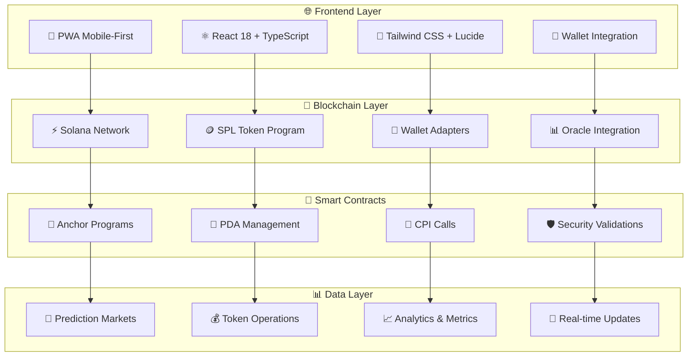

<div align="center">

# 🔮 **ORÁCULO** 
### *El Futuro de las Predicciones Descentralizadas*

[](https://solana.com/)
[](https://nextjs.org/)
[](https://www.typescriptlang.org/)
[](https://www.rust-lang.org/)
[](https://www.anchor-lang.com/)

[](https://opensource.org/licenses/MIT)
[](http://makeapullrequest.com)
[](https://github.com/Vaios0x/Oraculo/stargazers)

---

## 🌟 **Una Historia de Innovación**

> *"En un mundo donde la incertidumbre reina, nace **Oráculo** - la plataforma que convierte las predicciones en realidad a través de la sabiduría colectiva y la tecnología blockchain más avanzada."*

</div>

---

## 🎭 **El Storytelling de Oráculo**

### 📖 **El Problema**
En un mundo lleno de incertidumbre, las personas buscan formas de:
- 🔮 **Predecir el futuro** con precisión
- 💰 **Monetizar su conocimiento** sobre eventos futuros  
- 🛡️ **Protegerse** contra riesgos específicos
- 🎯 **Aprovechar** su intuición y análisis

### ✨ **La Solución: Oráculo**
**Oráculo** es más que una plataforma de predicciones - es un **ecosistema completo** que democratiza el acceso a la información del futuro mediante:

<div align="center">

### 🚀 **Tecnologías de Vanguardia**

| **Frontend** | **Blockchain** | **Smart Contracts** | **Infraestructura** |
|:------------:|:--------------:|:-------------------:|:-------------------:|
|  |  |  |  |
|  |  |  |  |
|  |  |  |  |
|  |  |  |  |

</div>

---

## 🏗️ **Arquitectura del Ecosistema**



---

## 🎯 **Características Principales**

### 🔮 **Mercados de Predicción Inteligentes**

<div align="center">

| **🎮 Deportes** | **🏛️ Política** | **💹 Economía** | **🔬 Tecnología** | **🎭 Entretenimiento** | **🧪 Ciencia** |
|:---------------:|:---------------:|:---------------:|:-----------------:|:---------------------:|:---------------:|
| ⚽ Resultados de partidos | 🗳️ Elecciones | 📈 Precios de activos | 🚀 Lanzamientos | 🏆 Premios | 🔬 Descubrimientos |
| 🏆 Campeonatos | 🏛️ Decisiones gubernamentales | 💰 Indicadores económicos | 📱 Adopción de tecnologías | 📺 Audiencias | 🧬 Avances tecnológicos |
| 📊 Récords | 📊 Encuestas | 💎 Criptomonedas | 🌐 Internet | 🎬 Eventos culturales | 🔬 Investigaciones |

</div>

### 💰 **Sistema de Recompensas Avanzado**

```typescript
// 🎯 Ejemplo de Creación de Mercado
const market = await oraculo.createMarket({
  title: "¿Bitcoin alcanzará $100,000 en 2024?",
  description: "Predicción sobre el precio de Bitcoin",
  endDate: new Date('2024-12-31'),
  outcomes: ['Sí', 'No'],
  oracle: 'Pyth Network',
  fee: 0.02 // 2% de comisión
});

// 💸 Participación en Mercado
const participation = await oraculo.participate({
  marketId: market.id,
  outcome: 'Sí',
  amount: 1000, // 1000 tokens
  prediction: 0.75 // 75% de confianza
});
```

### 🪙 **Operaciones de Tokens de Nueva Generación**

#### **🔄 Transferencias Inteligentes**
```typescript
// Transferencia con validación automática
const transfer = await tokenManager.transferTokens({
  source: sourceAccount,
  destination: destinationAccount,
  amount: 1000000n,
  authority: userAuthority,
  validation: {
    checkBalance: true,
    checkFrozen: true,
    checkDelegate: true
  }
});
```

#### **🔐 Sistema de Delegación Avanzado**
```typescript
// Delegación temporal con límites
const delegation = await tokenManager.approveDelegate({
  account: tokenAccount,
  delegate: delegateAccount,
  amount: 500000n,
  duration: 24 * 60 * 60 * 1000, // 24 horas
  conditions: {
    maxAmount: 1000000n,
    allowedOperations: ['transfer', 'burn']
  }
});
```

#### **🔥 Quema Controlada**
```typescript
// Quema con verificación de autoridad
const burn = await tokenManager.burnTokens({
  account: tokenAccount,
  amount: 100000n,
  authority: burnAuthority,
  verification: {
    checkAuthority: true,
    checkSupply: true,
    logEvent: true
  }
});
```

---

## 🚀 **Tecnologías de Vanguardia**

### **🎨 Frontend de Nueva Generación**

<div align="center">

#### **⚛️ React 18 + Next.js 14**
- **App Router** para navegación optimizada
- **Server Components** para rendimiento máximo
- **Streaming** para carga progresiva
- **Suspense** para experiencia fluida

#### **🎯 TypeScript 5.5.3**
- **Type Safety** completo
- **IntelliSense** avanzado
- **Refactoring** automático
- **Error Prevention** en tiempo real

#### **🎨 Tailwind CSS 3.4.14**
- **Utility-First** approach
- **Responsive Design** automático
- **Dark Mode** nativo
- **Custom Components** reutilizables

</div>

### **⚡ Blockchain Infrastructure**

<div align="center">

#### **🔗 Solana Integration**
```typescript
// Conexión optimizada a Solana
const connection = new Connection(
  'https://api.devnet.solana.com',
  {
    commitment: 'confirmed',
    wsEndpoint: 'wss://api.devnet.solana.com',
    httpHeaders: {
      'Content-Type': 'application/json'
    }
  }
);
```

#### **🪙 SPL Token Program**
```typescript
// Operaciones avanzadas de tokens
const tokenManager = new SPLTokenManager(connection);

// Crear token con extensiones
const token = await tokenManager.createTokenWithExtensions({
  mint: mintKeypair,
  decimals: 9,
  extensions: [
    'TransferFee',
    'Metadata', 
    'InterestBearing',
    'Pausable'
  ]
});
```

#### **🔐 Wallet Integration**
```typescript
// Soporte para múltiples wallets
const wallets = [
  new PhantomWalletAdapter(),
  new SolflareWalletAdapter(),
  new BackpackWalletAdapter(),
  new GlowWalletAdapter()
];
```

</div>

### **🤖 Smart Contracts Inteligentes**

#### **📜 Anchor Framework**
```rust
// Programa de mercado de predicciones
#[program]
pub mod oraculo_prediction_market {
    use super::*;
    
    pub fn create_market(
        ctx: Context<CreateMarket>,
        title: String,
        description: String,
        end_date: i64,
        outcomes: Vec<String>
    ) -> Result<()> {
        let market = &mut ctx.accounts.market;
        market.title = title;
        market.description = description;
        market.end_date = end_date;
        market.outcomes = outcomes;
        market.status = MarketStatus::Active;
        market.creator = ctx.accounts.creator.key();
        market.bump = ctx.bumps.market;
        
        Ok(())
    }
}
```

#### **🔑 Program Derived Addresses (PDA)**
```rust
// Derivación de PDAs para mercados
#[derive(Accounts)]
#[instruction(title: String)]
pub struct CreateMarket<'info> {
    #[account(
        init,
        seeds = [b"market", creator.key().as_ref(), title.as_bytes()],
        bump,
        payer = creator,
        space = 8 + Market::INIT_SPACE
    )]
    pub market: Account<'info, Market>,
    #[account(mut)]
    pub creator: Signer<'info>,
    pub system_program: Program<'info, System>,
}
```

#### **🔄 Cross Program Invocation (CPI)**
```rust
// CPI para transferencias de tokens
pub fn stake_tokens(
    ctx: Context<StakeTokens>,
    amount: u64
) -> Result<()> {
    let cpi_accounts = Transfer {
        from: ctx.accounts.user_token_account.to_account_info(),
        to: ctx.accounts.market_token_account.to_account_info(),
    };
    
    let cpi_ctx = CpiContext::new(
        ctx.accounts.token_program.to_account_info(),
        cpi_accounts,
    );
    
    token::transfer(cpi_ctx, amount)?;
    Ok(())
}
```

---

## 🎨 **Experiencia de Usuario Excepcional**

### **📱 Progressive Web App (PWA)**

<div align="center">

#### **✨ Características PWA**
- 🚀 **Instalable** en dispositivos móviles
- 📱 **Experiencia nativa** sin app store
- 🔄 **Funciona offline** con funcionalidad básica
- 🔔 **Push notifications** para actualizaciones
- ⚡ **Carga instantánea** con service workers

#### **🎯 Responsive Design**
- 📱 **Mobile-first** approach
- 💻 **Desktop optimizado**
- 🖥️ **Tablet friendly**
- 🌐 **Cross-browser** compatible

</div>

### **🔗 Integración de Wallets**

```typescript
// Conexión automática de wallets
const WalletProvider = ({ children }: { children: React.ReactNode }) => {
  const wallets = useMemo(
    () => [
      new PhantomWalletAdapter(),
      new SolflareWalletAdapter(),
      new BackpackWalletAdapter(),
      new GlowWalletAdapter(),
    ],
    []
  );

  return (
    <ConnectionProvider endpoint={clusterApiUrl('devnet')}>
      <WalletProvider wallets={wallets} autoConnect>
        <WalletModalProvider>
          {children}
        </WalletModalProvider>
      </WalletProvider>
    </ConnectionProvider>
  );
};
```

---

## 🛠️ **Instalación y Configuración**

### **📋 Prerrequisitos**

<div align="center">

| **Herramienta** | **Versión** | **Propósito** |
|:---------------:|:-----------:|:-------------:|
|  | 18+ | Runtime de JavaScript |
|  | 1.70+ | Compilación de contratos |
|  | Latest | Interacción con blockchain |
|  | 0.32.1+ | Framework de contratos |

</div>

### **🚀 Instalación Rápida**

```bash
# 🎯 Clonar el repositorio
git clone https://github.com/Vaios0x/Oraculo.git
cd Oraculo

# 📦 Instalar dependencias
npm install

# ⚙️ Configurar variables de entorno
cp .env.example .env

# 🔨 Compilar smart contracts
npm run anchor:build

# 🚀 Desplegar contratos
npm run anchor:deploy

# 🌐 Iniciar aplicación
npm run dev
```

### **🛠️ Scripts Disponibles**

<div align="center">

| **Categoría** | **Comando** | **Descripción** |
|:-------------:|:-----------:|:---------------:|
| **🚀 Desarrollo** | `npm run dev` | Servidor de desarrollo |
| **🏗️ Construcción** | `npm run build` | Build de producción |
| **▶️ Producción** | `npm run start` | Servidor de producción |
| **🔍 Linting** | `npm run lint` | Análisis de código |
| **📝 Tipos** | `npm run type-check` | Verificación de tipos |

| **⚡ Solana** | `npm run anchor:build` | Compilar programas |
| **🚀 Despliegue** | `npm run anchor:deploy` | Desplegar contratos |
| **🧪 Testing** | `npm run anchor:test` | Ejecutar pruebas |
| **⚙️ Configuración** | `npm run solana:setup` | Configurar Solana CLI |
| **💰 Balance** | `npm run solana:balance` | Verificar balance |

| **📚 Ejemplos** | `npm run examples:accounts` | Ejemplos de cuentas |
| **💸 Transacciones** | `npm run examples:transactions` | Ejemplos de transacciones |
| **📜 Programas** | `npm run examples:programs` | Ejemplos de programas |
| **🔑 PDAs** | `npm run examples:pda` | Ejemplos de PDAs |
| **🔄 CPI** | `npm run examples:cpi` | Ejemplos de CPI |

</div>

---

## 📚 **Ejemplos de Código**

### **🔮 Creación de Mercados**

```typescript
// Crear mercado de predicción
const market = await oraculo.createMarket({
  title: "¿Ethereum alcanzará $5,000 en 2024?",
  description: "Predicción sobre el precio de Ethereum",
  category: "Economía",
  endDate: new Date('2024-12-31'),
  outcomes: ['Sí', 'No'],
  oracle: {
    provider: 'Pyth Network',
    feed: 'ETH/USD',
    confidence: 0.95
  },
  fees: {
    creator: 0.02, // 2%
    platform: 0.01, // 1%
    oracle: 0.005 // 0.5%
  },
  metadata: {
    image: "https://example.com/ethereum-prediction.jpg",
    tags: ["ethereum", "crypto", "price", "prediction"]
  }
});
```

### **💰 Participación en Mercados**

```typescript
// Participar en un mercado
const participation = await oraculo.participate({
  marketId: market.id,
  outcome: 'Sí',
  amount: 1000, // 1000 tokens
  prediction: 0.75, // 75% de confianza
  strategy: {
    type: 'long',
    leverage: 1.0,
    stopLoss: 0.5,
    takeProfit: 2.0
  }
});

// Monitorear participación
const monitoring = await oraculo.monitorParticipation({
  marketId: market.id,
  userId: user.id,
  onUpdate: (data) => {
    console.log('Actualización de participación:', data);
  }
});
```

### **🪙 Operaciones de Tokens Avanzadas**

```typescript
// Sistema completo de tokens
const tokenSystem = new TokenSystem(connection);

// Crear token con extensiones
const token = await tokenSystem.createToken({
  mint: mintKeypair,
  decimals: 9,
  extensions: [
    {
      type: 'TransferFee',
      rate: 150, // 1.5%
      maxFee: 1000000n
    },
    {
      type: 'InterestBearing',
      rate: 500, // 5% anual
      authority: interestAuthority
    },
    {
      type: 'Pausable',
      authority: pauseAuthority
    }
  ]
});

// Operaciones en lote
const batchOperations = await tokenSystem.batchOperations([
  {
    type: 'mint',
    mint: token.mint,
    destination: userTokenAccount,
    amount: 1000000n
  },
  {
    type: 'transfer',
    source: userTokenAccount,
    destination: marketTokenAccount,
    amount: 500000n
  },
  {
    type: 'burn',
    account: userTokenAccount,
    amount: 100000n
  }
]);
```

### **🔐 Gestión de Autoridades**

```typescript
// Sistema de autoridades avanzado
const authorityManager = new AuthorityManager(connection);

// Crear jerarquía de autoridades
const hierarchy = await authorityManager.createHierarchy({
  root: rootAuthority,
  levels: [
    {
      level: 1,
      authority: mintAuthority,
      permissions: ['mint', 'burn']
    },
    {
      level: 2,
      authority: freezeAuthority,
      permissions: ['freeze', 'thaw']
    },
    {
      level: 3,
      authority: transferAuthority,
      permissions: ['transfer', 'approve']
    }
  ]
});

// Delegación temporal
const delegation = await authorityManager.delegate({
  from: rootAuthority,
  to: delegateAuthority,
  permissions: ['mint', 'transfer'],
  duration: 24 * 60 * 60 * 1000, // 24 horas
  conditions: {
    maxAmount: 1000000n,
    allowedOperations: ['mint', 'transfer']
  }
});
```

---

## 📊 **Métricas y Analytics**

### **📈 Dashboard de Rendimiento**

```typescript
// Sistema de métricas en tiempo real
const analytics = new AnalyticsSystem(connection);

// Métricas de mercado
const marketMetrics = await analytics.getMarketMetrics({
  marketId: market.id,
  timeframe: '24h',
  metrics: [
    'volume',
    'participants',
    'price',
    'volatility',
    'liquidity'
  ]
});

// Métricas de usuario
const userMetrics = await analytics.getUserMetrics({
  userId: user.id,
  timeframe: '7d',
  metrics: [
    'totalStaked',
    'totalWon',
    'winRate',
    'averageStake',
    'favoriteCategories'
  ]
});

// Análisis predictivo
const prediction = await analytics.predictMarketOutcome({
  marketId: market.id,
  model: 'ensemble',
  features: [
    'historicalData',
    'socialSentiment',
    'marketVolatility',
    'participantBehavior'
  ]
});
```

### **🔔 Sistema de Notificaciones**

```typescript
// Notificaciones inteligentes
const notifications = new NotificationSystem();

// Suscribirse a eventos
await notifications.subscribe({
  userId: user.id,
  events: [
    'marketCreated',
    'marketResolved',
    'priceUpdate',
    'participationUpdate',
    'winningNotification'
  ],
  channels: ['push', 'email', 'inApp']
});

// Configurar alertas
await notifications.setAlert({
  marketId: market.id,
  conditions: [
    {
      type: 'priceChange',
      threshold: 0.1, // 10%
      direction: 'up'
    },
    {
      type: 'volumeSpike',
      threshold: 2.0, // 200%
      timeframe: '1h'
    }
  ]
});
```

---

## 🎯 **Roadmap de Desarrollo**

### **🚀 Fase 1: MVP (Actual)**

<div align="center">

| **✅ Completado** | **🔄 En Progreso** | **📋 Próximo** |
|:----------------:|:------------------:|:--------------:|
| ✅ Frontend PWA | 🔄 Smart Contracts | 📋 Oracle Integration |
| ✅ Wallet Integration | 🔄 Token Operations | 📋 Advanced Analytics |
| ✅ Basic UI/UX | 🔄 Market Creation | 📋 Mobile App |
| ✅ Solana Integration | 🔄 Participation | 📋 Governance |

</div>

### **🌟 Fase 2: Expansión**

- 🎯 **Mercados Complejos**: Múltiples resultados, mercados condicionales
- 🏆 **Sistema de Reputación**: Puntuaciones de usuarios, líderes
- 📊 **Analytics Avanzados**: Gráficos interactivos, predicciones ML
- 🔌 **API Pública**: Integración con terceros, webhooks

### **🚀 Fase 3: Escalabilidad**

- ⚡ **Alta Frecuencia**: Mercados de segundos, trading automático
- 🔗 **Multi-Chain**: Ethereum, Polygon, Avalanche
- 📱 **App Nativa**: iOS/Android con funcionalidades avanzadas
- 🏛️ **Gobernanza DAO**: Votación descentralizada, propuestas

---

## 🤝 **Contribuir al Proyecto**

### **🌟 Cómo Contribuir**

<div align="center">

#### **1. 🍴 Fork el Proyecto**
```bash
# Fork en GitHub, luego clonar
git clone https://github.com/TU_USUARIO/Oraculo.git
cd Oraculo
```

#### **2. 🌿 Crear Rama de Feature**
```bash
# Crear rama para tu feature
git checkout -b feature/amazing-feature
```

#### **3. 💻 Desarrollar**
```bash
# Hacer cambios
npm run dev
npm run test
npm run lint
```

#### **4. 📝 Commit**
```bash
# Commit con mensaje descriptivo
git commit -m "feat: add amazing feature"
```

#### **5. 🚀 Push y PR**
```bash
# Push a tu fork
git push origin feature/amazing-feature
# Crear Pull Request en GitHub
```

</div>

### **📋 Tipos de Contribuciones**

| **Tipo** | **Descripción** | **Ejemplos** |
|:--------:|:---------------:|:------------:|
| 🐛 **Bug Fixes** | Corrección de errores | Fix wallet connection, resolve UI bugs |
| ✨ **Features** | Nuevas funcionalidades | New market types, advanced analytics |
| 📚 **Documentation** | Mejora de documentación | API docs, tutorials, examples |
| 🎨 **UI/UX** | Mejoras de interfaz | Better mobile experience, animations |
| ⚡ **Performance** | Optimizaciones | Faster loading, reduced gas costs |
| 🧪 **Testing** | Tests y calidad | Unit tests, integration tests |

---

## 📄 **Licencia y Legal**

### **📜 Licencia MIT**

Este proyecto está bajo la **Licencia MIT** - ver el archivo [LICENSE](LICENSE) para más detalles.

### **⚖️ Términos de Uso**

- ✅ **Uso Comercial** permitido
- ✅ **Modificación** permitida
- ✅ **Distribución** permitida
- ✅ **Uso Privado** permitido
- ❌ **Responsabilidad** limitada
- ❌ **Garantía** sin garantías

---

## 🔗 **Enlaces y Recursos**

### **📚 Documentación**

<div align="center">

| **Recurso** | **URL** | **Descripción** |
|:-----------:|:-------:|:---------------:|
| 📖 **Documentación** | [docs.oraculo.dev](https://docs.oraculo.dev) | Documentación completa |
| 🎥 **Tutoriales** | [tutorials.oraculo.dev](https://tutorials.oraculo.dev) | Guías paso a paso |
| 📚 **API Docs** | [api.oraculo.dev](https://api.oraculo.dev) | Documentación de API |
| 🔧 **SDK** | [sdk.oraculo.dev](https://sdk.oraculo.dev) | Software Development Kit |

</div>

### **🌐 Comunidad**

<div align="center">

| **Plataforma** | **Enlace** | **Descripción** |
|:--------------:|:---------:|:---------------:|
| 💬 **Discord** | [discord.gg/oraculo](https://discord.gg/oraculo) | Chat en tiempo real |
| 🐦 **Twitter** | [@oraculo_dev](https://twitter.com/oraculo_dev) | Actualizaciones |
| 📱 **Telegram** | [t.me/oraculo](https://t.me/oraculo) | Noticias y updates |
| 📺 **YouTube** | [youtube.com/oraculo](https://youtube.com/oraculo) | Videos y demos |

</div>

### **🛠️ Herramientas de Desarrollo**

<div align="center">

| **Herramienta** | **URL** | **Propósito** |
|:---------------:|:-------:|:-------------:|
| 🔧 **Solana CLI** | [docs.solana.com](https://docs.solana.com) | Interacción con blockchain |
| 📜 **Anchor** | [anchor-lang.com](https://anchor-lang.com) | Framework de contratos |
| 🪙 **SPL Token** | [spl.solana.com](https://spl.solana.com) | Programa de tokens |
| 🔗 **Web3.js** | [solana-labs.github.io](https://solana-labs.github.io) | SDK de JavaScript |

</div>

---

## 💡 **¿Por qué Oráculo?**

### **🌟 La Visión**

> *"En un mundo lleno de incertidumbre, **Oráculo** democratiza el acceso a la información del futuro mediante la sabiduría colectiva y la tecnología blockchain más avanzada."*

### **🎯 Casos de Uso**

<div align="center">

| **👤 Usuario Individual** | **🏢 Empresa** | **🏛️ Gobierno** | **🎓 Academia** |
|:------------------------:|:--------------:|:---------------:|:---------------:|
| 🔮 **Predicciones Personales** | 🛡️ **Hedge de Riesgos** | 📊 **Políticas Públicas** | 🔬 **Investigación** |
| 💰 **Monetizar Conocimiento** | 📈 **Análisis de Mercado** | 🗳️ **Elecciones** | 📚 **Educación** |
| 🎯 **Inversiones Inteligentes** | 🏆 **Ventaja Competitiva** | 🌍 **Cambio Climático** | 🧪 **Experimentos** |
| 🎮 **Entretenimiento** | 💼 **Estrategia Corporativa** | 🏥 **Salud Pública** | 📊 **Datos Abiertos** |

</div>

### **🚀 Beneficios Únicos**

- 🔮 **Predicciones Precisas**: Sabiduría colectiva vs. opinión individual
- 💰 **Monetización Justa**: Recompensas por conocimiento correcto
- 🛡️ **Transparencia Total**: Todas las transacciones públicas
- ⚡ **Velocidad Suprema**: Transacciones en segundos
- 🌍 **Acceso Global**: Sin barreras geográficas
- 🔒 **Seguridad Máxima**: Blockchain inmutable

---

## 🎉 **¡Únete a la Revolución!**

<div align="center">

### **🌟 ¡El futuro es predecible con Oráculo!**

[](https://github.com/Vaios0x/Oraculo/stargazers)
[](https://github.com/Vaios0x/Oraculo/network)
[](https://github.com/Vaios0x/Oraculo/issues)
[](https://github.com/Vaios0x/Oraculo/pulls)

---

### **🔮 ¡Convierte tus predicciones en realidad!**

**¿Tienes una predicción sobre el futuro?**  
**¿Quieres monetizar tu conocimiento?**  
**¿Buscas protegerte contra riesgos?**

## **¡Oráculo es tu plataforma!** 🚀✨

---

<div align="center">

**Construido con ❤️ por el equipo de Oráculo**

*"El futuro no está escrito en las estrellas, está en tus predicciones."* 🔮

</div>